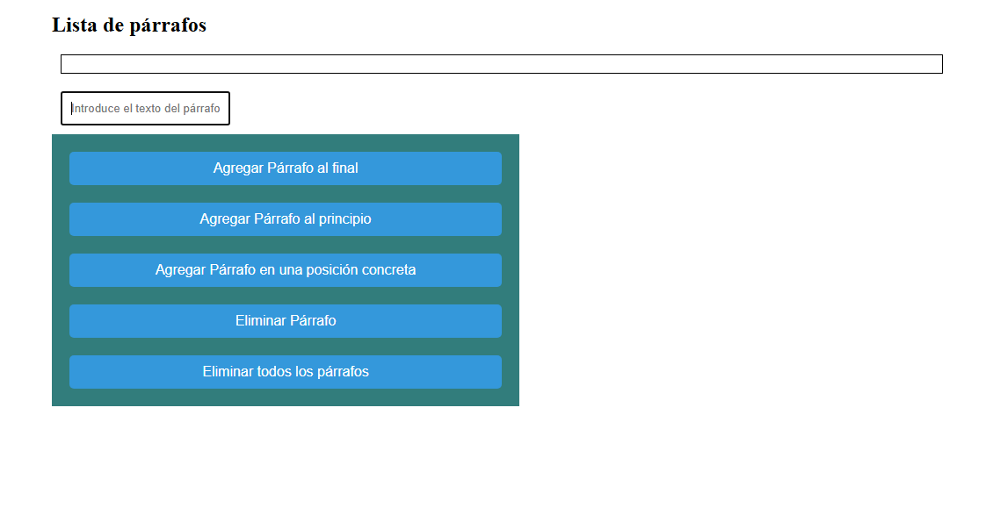

## Ejemplo 7  Manipulando el DOM

Partimos de la siguiente página.

## Se pide el siguiente código JavaScript
document.getElementById("agregarFinal").addEventListener("click", function(){
    // Crear un nuevo párrafo
   
    //añadir texto al párrafo
  
    //añadir el párrafo al contenedor
   
    //agregar el color de texto del nuevo parrafo sea rojo
    parrafo.style.color = "red";
});
//agregar párrafo al principio
document.getElementById("agregarPpio").addEventListener("click", function(){
    // Crear un nuevo párrafo
   
    //añadir texto al párrafo
   
    //añadir el párrafo al contenedor .prepend(parrafo)
   
    //agregar estilos al párrafo texto azul
   
});
//agregar párrafo en una posición concreta
document.getElementById("agregarPosicion").addEventListener("click", function(){
    // Crear un nuevo párrafo
  
    //añadir texto al párrafo
  
    //añadir el párrafo al contenedor inserBefore
  
    //agregar estilos color del texto verde
    
});
//eliminar el primer párrafo
document.getElementById("eliminar").addEventListener("click", function(){
    //eliminar el primer párrafo
   
});
document.getElementById("eliminarTodos").addEventListener("click", function(){
    //eliminar todos los párrafos
   
});