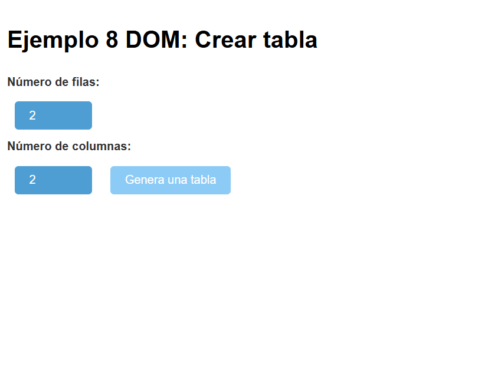
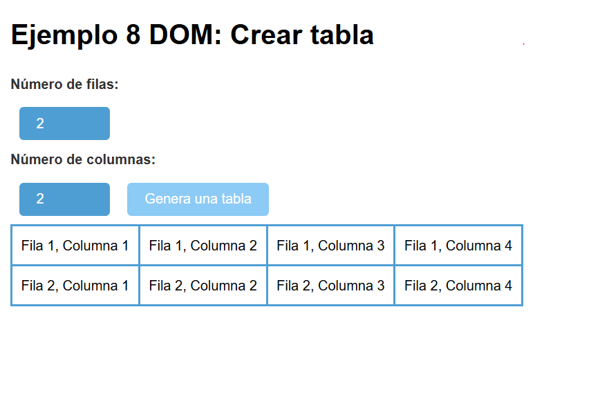

# Unidad 3
## Actividad 8 - Añadir elementos al DOM
Partimos de dos input numéricos para solicitar el número de filas y columnas

Cuando hacemos clic en el botón "Generar una tabla"

Si modifico el número de filas o columnas, nos genera la nueva tabla.
